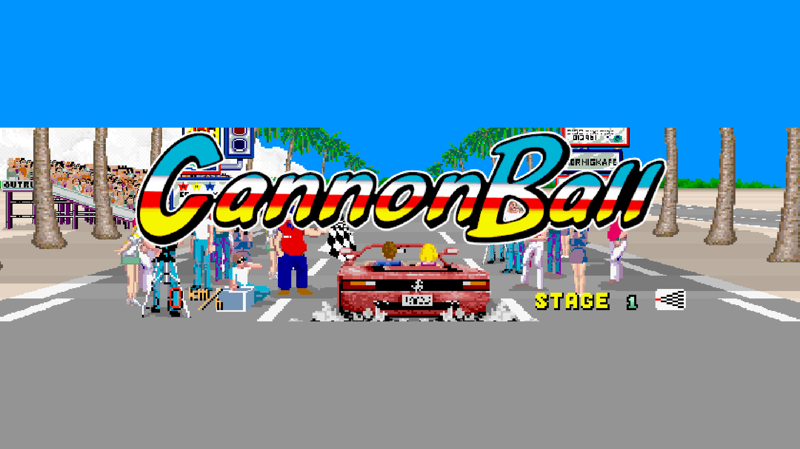

# Cannonball

### Description

Cannonball is an enhanced version of the seminal arcade racer OutRun designed by Yu Suzuki.

### License

Non-commercial

### Icon

### Fanart

### Screenshots

Help make me screenshots!
