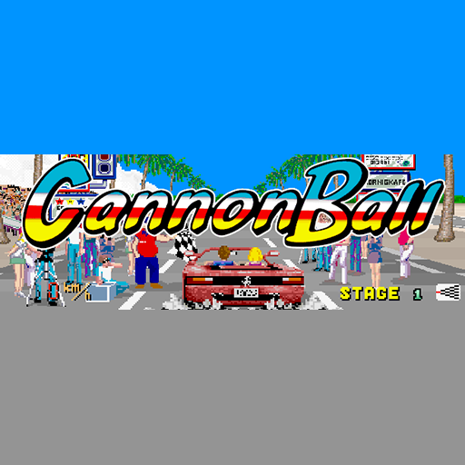

# Cannonball

### Description

Cannonball is an OutRun game engine recreation written by Chris White in 2014.

### License

Non-commercial

### Icon

### Fanart

Help make me fanart!

### Screenshots

Help make me screenshots!
